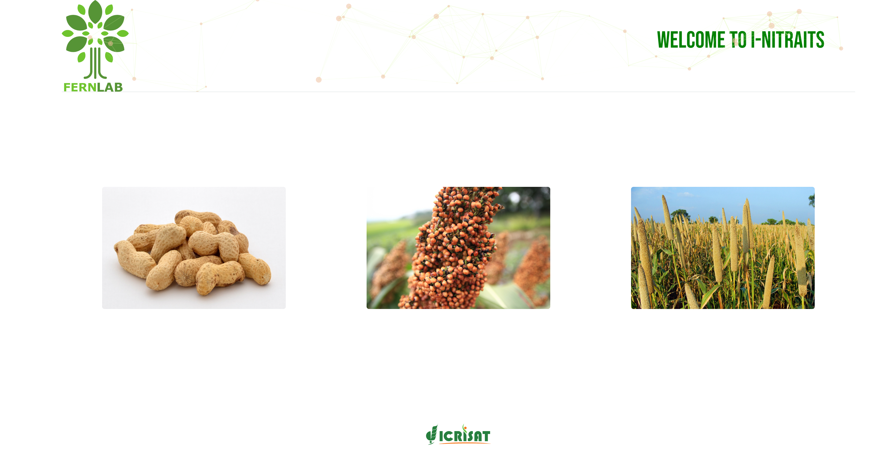

# iNITRAITS

Using Flask to build a machine learning app to predict the starch content of pearl millet.

## Built With

- Python
- FLask 
- HTML
- Bootstrap
- CSS grid
- JavaScript
- Particles.js
- DataTables.js

## Get Live Demo
[Live Demo Link](https://adamavip.pythonanywhere.com/)

## Installation

Clone the repository
```buildoutcfg
git clone https://github.com/adamavip/iNITRAITS.git

```

Move to the directory
```buildoutcfg
cd iNIRS
```

Install packages:

```
$ pip install -r requirements.txt
```

Run the project on local server
```buildoutcfg
python main.py
```

## Author
To open project with vs code 

`code .`

## Authors

👤 **Adama NDOUR**

- GitHub: [@adamavip](https://github.com/adamavip)
- Twitter: [@adamavip](https://twitter.com/adamavip)
- LinkedIn: [Adama NDOUR](https://www.linkedin.com/in/adama-ndour-a3a4344a/)

## 🤝 Contributing
Contributions, issues, and feature requests are welcome!
Feel free to check the [issues page](../../issues/).

## Show your support
Give a ⭐️ if you like this project!

## 📝 License
This project is [MIT](./MIT.md) licensed.
